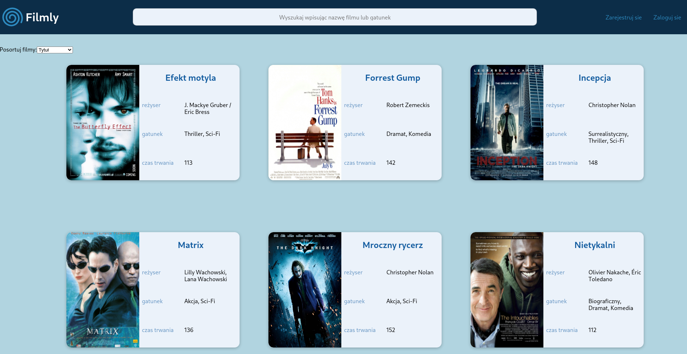
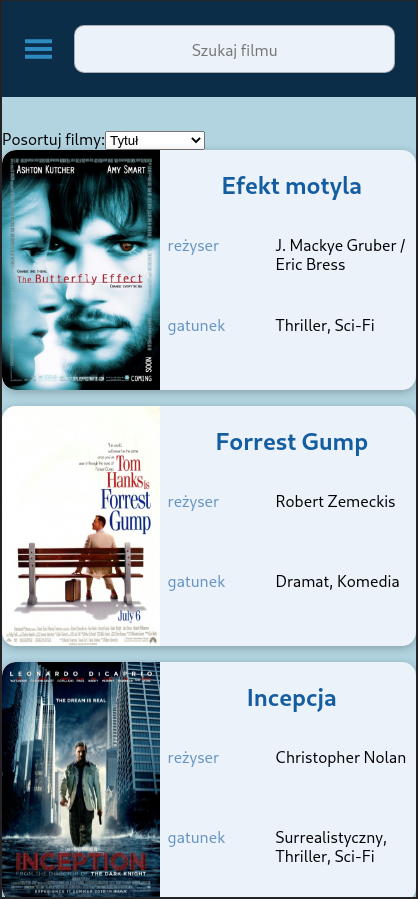

# filmyApp
A webapp using React.js to display information related to movies. It provides functions you'd expect from a service like imdb, such as register a new user, connect to already existed account, comments and simple admin panel. FilmlyApp uses [filmlyBackend](https://github.com/patgrajkowski/filmlyBackend) as backend server and comunicates with it via API.
## Demo
Here is a working live demo that runs inside docker on Heroku https://filmlyapp.herokuapp.com/filmy
## Preview
### Home page

### Movie page

### Login form

### Register form

## Mobile support
This app provides support for mobile devices <br/>
    
## Building and usage
You can use this app in live demo or build it yourself.\
In order to build this app you will need Node.js and npm.
```bash
#Clone this repository
git clone https://github.com/patgrajkowski/filmlyApp.git
#Go into repositorty
cd filmlyApp
#Download dependencies
npm install
#Build
npm run build
#Serve
npx serve build
```
